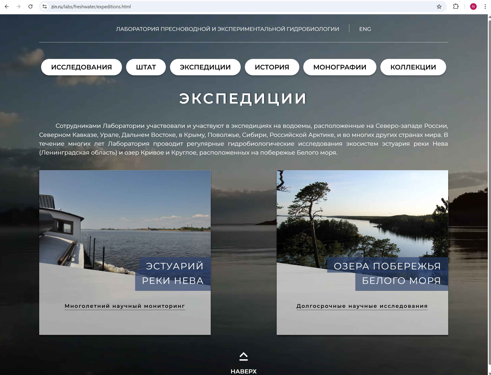
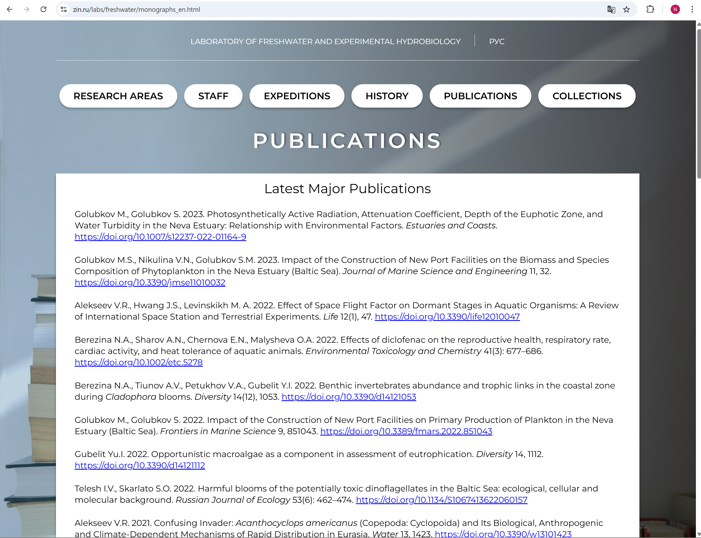
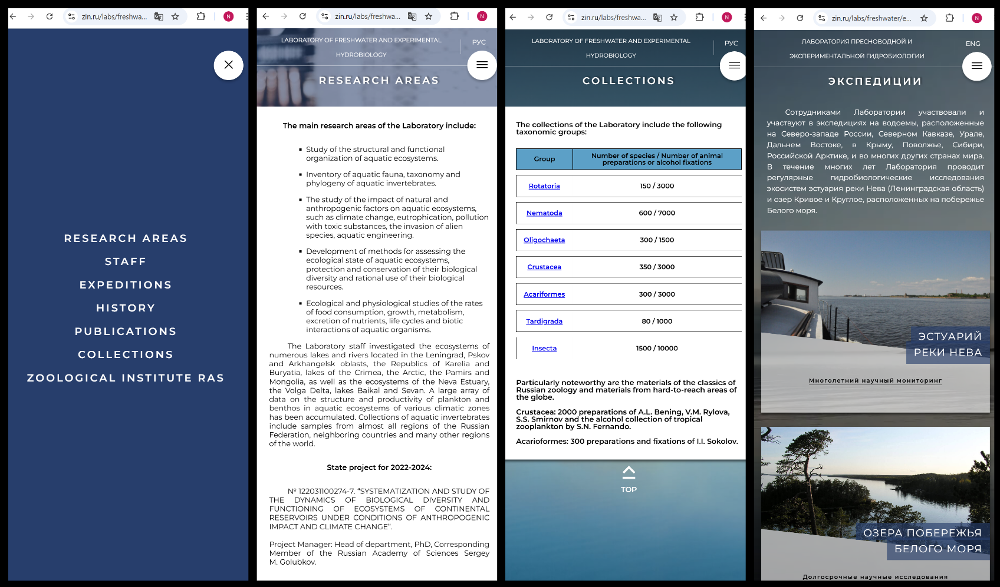

# 🌿 Website for the Laboratory of Freshwater and Experimental Hydrobiology

- Static website created for a real laboratory as part of a practical assignment.
- The task was to design and build a fully responsive layout **without using JavaScript**.

## 🛠 Tech Stack

- **HTML5**
- **CSS3** (Flexbox, Grid, Adaptive Layout)

## 🎯 Project Goals

- Design and develop a clean, informative website for the laboratory
- Implement multi-page navigation (static pages)
- Ensure responsive layout for desktop and mobile devices
- Follow the client's design guidelines and content structure

## 📂 Project Structure

- `/css` – styles for the website
- `/img` – images used on the website
- `/index.html` – main page
- `/science.html` – research areas page
- `/expeditions.html` – expeditions page
- `/history.html` – history page
- `/monographs.html` – publications page
- `/collections.html` – collections page
- English version of the pages is available (e.g., `index_en.html`, `science_en.html`, `expeditions_en.html`, etc.)

## 🖼 Screenshots

> _Screenshots are taken from the live website._

> 🖼 **Main Page**  
> 

> 🖼 **Expeditions**  
> 

> 🖼 **Publications (English version)**  
> 

> 🖼 **Mobile devices**  
> 

## 🚀 Demo Link

🔗 [Live Demo on GitHub Pages](https://natalia28-88.github.io/Website-of-the-Laboratory-of-Freshwater-and-Experimental-Hydrobiology/)

## 🚀 Live Demo

🔗 You can view the website here: [Live Demo](https://www.zin.ru/labs/freshwater/)

## 💡 Notes

- This project was intentionally developed **without JavaScript**, as per task requirements.
- Focus on **semantic HTML**, **responsive CSS**, and **pixel-perfect design**.
- My first real-world website project — from **design to deployment**.

## 📄 License

MIT
